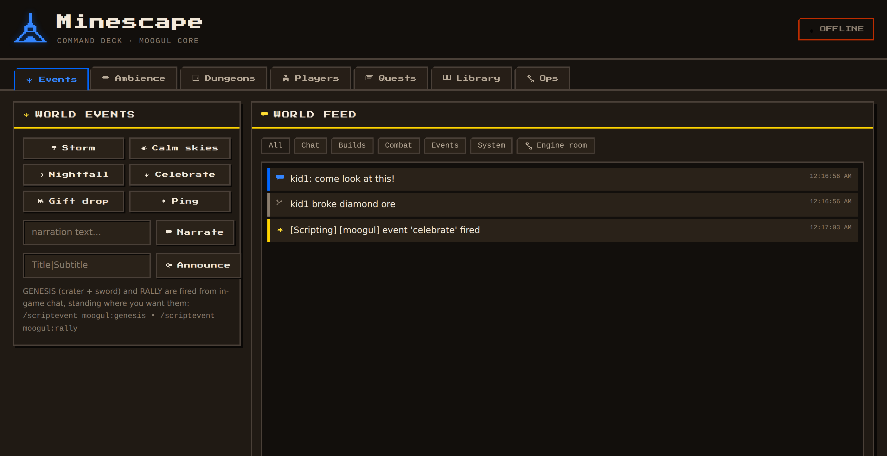

# MINESCAPE — the forever server

A hand-built story RPG inside a free-roam Minecraft Bedrock survival world, self-hosted for
family and invited friends — allowlist-only, Xbox-authenticated, native Bedrock end to end
(everything renders faithfully on Switch, no translation layers). Every piece of it —
the world-event engine, the parent-oversight telemetry, the pixel-art **Command Deck**
control room — is custom-built and lives in this repo.



## Documentation

| File | What it covers |
|---|---|
| [`CLAUDE.md`](CLAUDE.md) | Architecture map: engine, Command Deck, ops scripts, conventions |
| [`DESIGN.md`](DESIGN.md) | The Moogul Design System — palette, type, components, motion |
| [`DIRECTIONS-FOR-CLAUDE-CODE.md`](DIRECTIONS-FOR-CLAUDE-CODE.md) | The forward build plan, phase by phase |

## First night — three double-clicks

1. **`1-SETUP.bat`** — downloads the official Bedrock Dedicated Server (1.26.33.2),
   installs the config, allowlist, and Moogul Core packs. One-time (safe to re-run).
2. **`2-START-SERVER.bat`** — launches the world through the **Command Deck**
   (http://localhost:8420 opens automatically). Windows Firewall will ask once — Allow.
   *Deck needs Node.js (LTS, from nodejs.org). Without it, this starts a plain console instead.*
3. Before the kids join: edit `server/allowlist.json` and replace `YOUR_GAMERTAG_HERE`
   with your own gamertag (or use the deck's INVITE box).

## Making yourself operator (one-time)

Join the world once, then look in the deck's World Feed for your join line — it shows your
`xuid`. Put it in `server/permissions.json`:

```json
[ { "permission": "operator", "xuid": "PASTE_XUID_HERE" } ]
```

Restart. You now have full command power in-game; the deck has it regardless.

## How the kids connect (Switch)

Same Wi-Fi as this PC: Play → Servers/Friends tab — the server should appear as a LAN game.
If it doesn't, the fallback is BedrockConnect (change the Switch DNS to a BedrockConnect
server, pick any Featured Server, enter this PC's local IP, port 19132). For friends joining
from *their* houses you'll need port forwarding (UDP 19132) — do this deliberately, later.

## The Command Deck (http://localhost:8420)

Your control room — a tabbed, pixel-art console built on the [Moogul Design System](DESIGN.md):

- **Events** — one-click world events: storm, calm, nightfall, celebration, gift drops,
  narration, and titled announcements.
- **Ambience** — force weather/time, lock day or night, and the music library pipeline
  (drop `.ogg` files in `music/`, rebuild, play globally).
- **Players** — every player telemetry has seen: per-player timelines, chat history,
  block break/place + death counts, last known location, and a **forensics query**
  ("who broke blocks near X within N minutes") to settle disputes with receipts.
- **World Feed** (always visible) — translates both telemetry and the raw server log into
  plain English ("kid1 fell from a high place near the lake village," not a stack trace),
  filterable by Chat / Builds / Combat / Events / System, with the raw console tucked
  behind a collapsed "Engine room" toggle.
- **Dungeons / Quests / Library** — placeholders for upcoming phases (see
  [`DIRECTIONS-FOR-CLAUDE-CODE.md`](DIRECTIONS-FOR-CLAUDE-CODE.md)).
- **Ops** — server start/stop, a raw command console (anything you'd type in a server
  console works here), and gatekeeping (invite a gamertag, list the allowlist, who's on).

**In-game storyteller commands** (type in chat, as op):

| Command | Effect |
|---|---|
| `/scriptevent moogul:genesis` | Carve the great crater beneath you + plant the sword in the stone |
| `/scriptevent moogul:rally` | Teleport everyone to you |
| `/scriptevent moogul:narrate <text>` | Italic story whisper to all players |
| `/scriptevent moogul:announce Title\|Subtitle` | Dramatic titled announcement |

The sword in the stone cannot be pulled, pushed, or broken. It whispers when they try.

## Privacy

Telemetry (chat logs, locations, per-player activity) is written to `deck/data/` —
gitignored, local-only, never leaves the PC. Same for `config/allowlist.json` and
`config/permissions.json` (gamertags and XUIDs) and the live world itself. This repo is
the *source*; anything that's actually about the people playing stays off GitHub.

## The world

- **Seed `6246468738900744`** — a cherry-grove lake valley with two villages: a relaxed,
  beautiful canvas for late-night building. Alternates if you ever regenerate:
  `302304127329527063` (four villages at spawn), `6942710633571786` (frozen-peak valley).
- Survival, easy difficulty, allowlist ON, Xbox-authenticated only, max 8 players.
- Cheats enabled (needed for events/ops) — fine on a private server.

## Folder map

```
minescape/
├── 1-SETUP.bat / 2-START-SERVER.bat / 3-BACKUP.bat / 4-TEST-WORLD.bat
├── config/            ← source of truth for server settings
├── packs/
│   ├── moogul_core_bp/   ← the ENGINE: event router, telemetry, genesis, sword, scripts
│   │   └── structures/     ← hand-built .mcstructure pieces committed from Spelljammer
│   └── moogul_core_rp/   ← the LOOK: models, textures; music & voices go here later
├── deck/              ← Command Deck (Node): deck.js + tabbed pixel UI (see DESIGN.md)
│   ├── assets/           ← self-hosted font + hand-authored pixel icon set
│   └── data/             ← telemetry (gitignored — private, local-only)
├── dungeons/           ← how to build one (procedural or hand-built) — see its README
├── docs/               ← README assets
├── scripts/           ← setup.ps1, backup.ps1, testworld.ps1
├── world_templates/   ← pack wiring copied into new worlds
├── server/            ← created by setup: BDS + worlds (Minescape, and Spelljammer once
│                          `4-TEST-WORLD.bat refresh` has been run)
└── backups/           ← created by 3-BACKUP.bat (keeps newest 30)
```

**Back up `server/worlds/` like family photos.** `3-BACKUP.bat` does it with one click
(best while the server is stopped).

**Spelljammer** is a same-seed replica of Minescape for building and testing without any
risk to the live world — `4-TEST-WORLD.bat` copies it, flips which one the server boots
into, and `commit`s a finished hand-built piece (exported as a `.mcstructure`) back into
Minescape when it's ready. It's one-directional and never runs automatically; nothing in
Spelljammer reaches Minescape until you explicitly commit it.

## On "mods" — how content works here

Bedrock's equivalent of mods is **add-ons** (behavior + resource packs). The rock-solid ones
for a private server are the ones we build — they can't break your world or your trust.
When you want community content, the trustworthy sources are CurseForge (Bedrock section)
and MCPEDL — download the `.mcaddon`/`.mcpack`, and we'll vet and install it together into
`server/behavior_packs` / `resource_packs` + the world JSONs. Marketplace packs can't be
installed on a dedicated server — that content stays on the client.

## Status

- ✅ **Foundation** — engine, Command Deck, ops scripts.
- ✅ **Moogul Design System** — the deck's pixel-art visual language ([`DESIGN.md`](DESIGN.md)).
- ✅ **World Feed v2 + telemetry** — human-readable feed, Players tab, forensics query.
- ✅ **Marks + first dungeon** — the Alligator Knight's Lair (boss fight, ghost-block
  trap, locked door) — see [`dungeons/README.md`](dungeons/README.md) for how to build
  the next one, procedurally or hand-built.
- ✅ **Karma + judge** — flavor-only automatic karma, plus a judge-only layer (jail,
  fines, grants) for settling disputes with forensics receipts.
- ✅ **Spelljammer** — a same-seed test/build world, `4-TEST-WORLD.bat` (`refresh` /
  `build` / `play` / `commit` / `status`), never touches Minescape until you commit.
- ⚠️ Everything above the telemetry line is **unverified against a live server** — built
  from an environment with no access to one. Watch the World Feed on first restart.
- ⏳ Epic events, characters/stats/quests, creator tools, dual-mode play, invite cards —
  see [`DIRECTIONS-FOR-CLAUDE-CODE.md`](DIRECTIONS-FOR-CLAUDE-CODE.md) for the full plan.

When the world outgrows this PC: move the whole folder to an always-on mini-PC. The world
is just files; the forever plan is a $150 N100 box in a closet.
